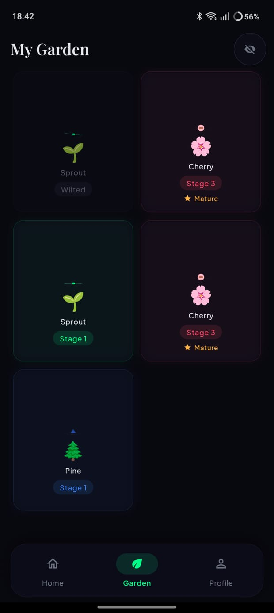
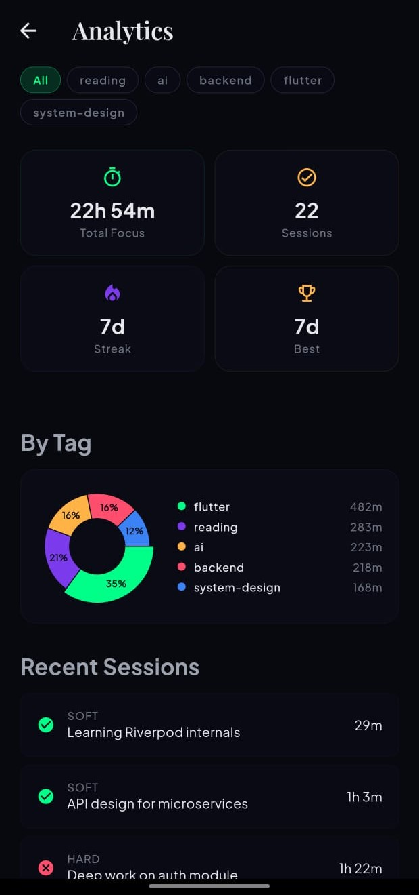
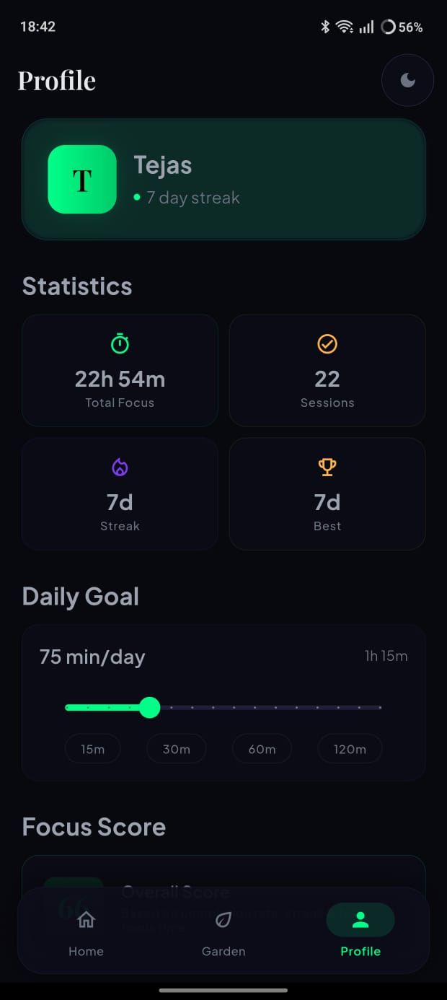
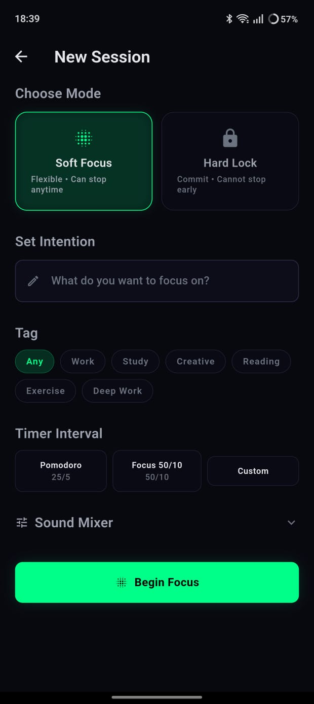
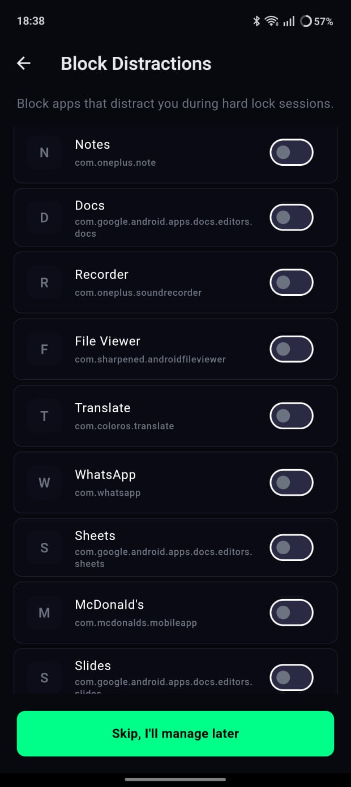
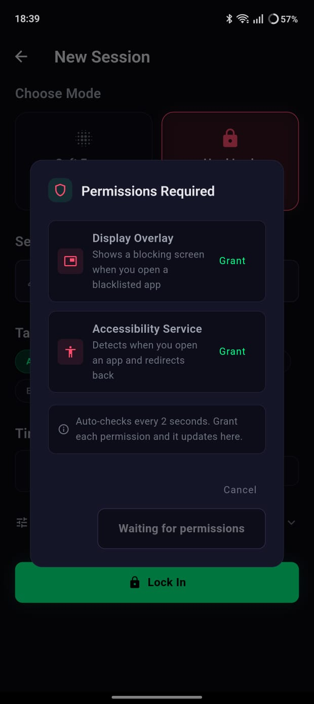
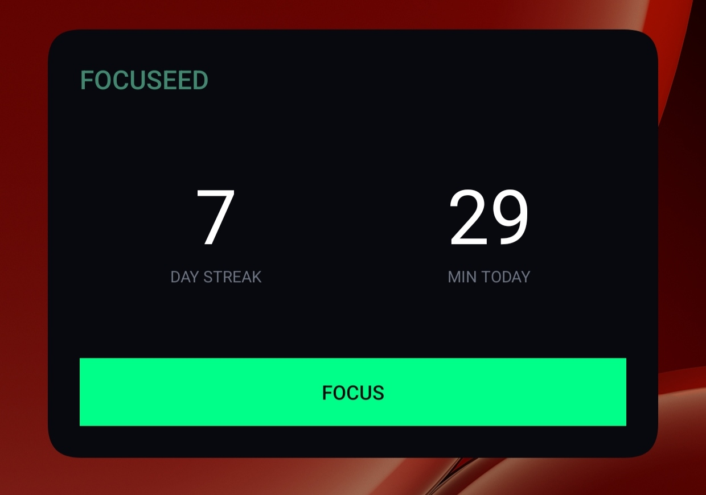

# Focuseed

A focus timer app that turns your consistency into a living garden. Complete deep work sessions to plant and grow trees. Neglect them and they wilt.

<p float="left">
  
  
  
  
</p>

## Features

- **Focus Timer** - Soft Focus & Hard Lock (grayscale overlay, notification suppression)
- **Growing Garden** - Plant trees with each session; they grow with consistency and wilt without care
- **Analytics Dashboard** - Charts, streaks, tags, focus score, monthly trends
- **Sound Mixer** - Mix 5 ambient tracks (rain, lofi, white noise, forest, drone)
- **Session Journal** - Post-session reflections with history

<p float="left">
  
  
  
</p>

- **App Blacklist** - Block distracting apps across all sessions (Android)

<p float="left">
  
  
</p>

- **Home Screen Widget** - Streak & minutes at a glance (Android)


- **Privacy First** - All data stays on device. No accounts, no cloud.

## Download APK

Pre-built APKs are in the `downloads/` folder of this repo:

| File | Device |
|------|--------|
| `[ARM64] Focuseed v1.0.0.apk` | Most modern Android phones |
| `[ARM32] Focuseed v1.0.0 (older phones).apk` | Older 32-bit devices |
| `[x86_64] Focuseed v1.0.0 (emulator).apk` | Android emulators |

## Getting Started

```bash
cd focus_app
flutter pub get
dart run build_runner build
flutter run
```

## Architecture

```
lib/
  core/
    db/          Drift database (SQLite) - tables and DAOs
    services/    Session logic, tree lifecycle, streaks, audio, lock, notifications
  state/         Riverpod providers
  screens/       UI screens (home, focus, garden, analytics, journal, profile, etc.)
  theme/         Theme configuration (light/dark)
  components/    Reusable UI widgets
android/app/src/main/kotlin/com/focusapp/focus_app/
  FocusWidgetProvider.kt          Home screen widget
  FocusAccessibilityService.kt    Blacklist enforcement
  FocusForegroundService.kt       Hard lock foreground service
  OverlayManager.kt               Grayscale overlay
```

## Development

```bash
flutter test                         # Run tests
dart run build_runner build          # Regenerate Drift code
flutter analyze                       # Should show 0 errors, 0 warnings
```

Configuration points:
- Ambient sound URLs: `lib/core/services/audio_service.dart`
- Tree species and colors: `lib/screens/garden_screen.dart`
- Wilting duration: `lib/core/services/tree_lifecycle_service.dart`

## License

MIT - see [LICENSE](LICENSE.md) for details.

## Contributing

Contributions welcome! See [CONTRIBUTING](CONTRIBUTING.md) for guidelines.
